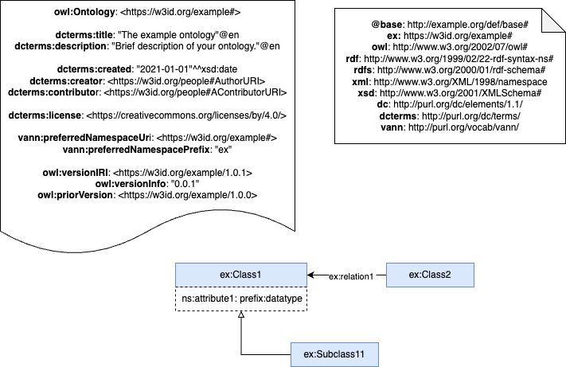

# The Parking Ontology

The Parking Ontology represents data of public and private parking lots in a municipality. It includes the representation of parking both within and outside the public road. Its scope is limited to data that can be used for mobility management purposes, i.e. vehicle access to parking, occupancy levels, spaces by permit type (e.g. residents) and spaces by vehicle type, which are part of the usual functions of local entities.

# Purpose and scope of the ontology

The purpose of this ontology is to provide a common vocabulary for representing the main entities and data of parking lots in a municipality. Its scope is limited to data that can be used for the purposes of maintaining and accessing the parking inventory, as well as managing its mobility (vehicle access to parking), which are part of the usual functions of local entities.

# Prefix and namespace
The prefix of the Parking Ontology is: edintapar and it is published in the namespace: [http://vocab.linkeddata.es/datosabiertos/def/urbanismo-infraestructuras/aparcamiento#](http://vocab.linkeddata.es/datosabiertos/def/urbanismo-infraestructuras/aparcamiento#)

# Ontology conceptualization

# Repository structure

The repository contains the following directories:

| Folder | Description |
|--------|--------------|
| **diagrams/** | Stores diagrams and other resources representing the conceptual model of the ontology (e.g., class hierarchies, relationships). |
| **documentation/** | Stores the HTML or human oriented documentation of the ontology and related artefacts. |
| **examples/** | Includes examples that demonstrate how to instantiate or apply the ontology in real data scenarios. |
| **kos/** | Stores controlled vocabularies or KOS implementation, usually SKOS implementations in rdf. |
| **ontology/** | Contains the actual ontology implementation files in formats such as `.owl`, `.rdf`, `.ttl`, or `.jsonld`. |
| **requirements/** | Contains all documents used to define the ontology's requirements: data example, competency questions, functional requirements, use cases, etc. |
| **shapes/** | Contains the SHACL shapes used to define and validate ontology constraints. |

# Maintenance and evolution

To handle incidents or suggested improvements regarding the ontology, we recommend following the guidelines provided in ([Issues Management](./ISSUES.md)) to generate an incident.

# Funding

This ontology has been developed in the context of the Data Space for Smart Urban Infrastructures ([EDINT](https://edint.es/)).

