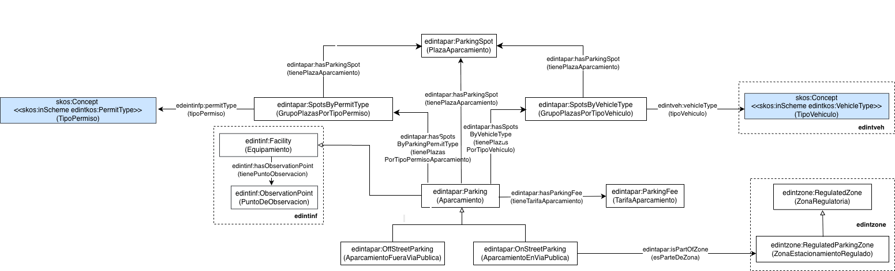

# Ontología de Aparcamiento (The Parking Ontology)

La ontología de Aparcamiento representa los datos de aparcamientos públicos y privados de un municipio. Se incluye la representación de aparcamientos dentro y fuera de la vía pública. Su alcance se limita a los datos que pueden ser utilizados con el propósito de la gestión de movilidad, es decir accesos de vehículos a los aparcamientos, nivel de ocupación, plazas según tipo de permiso (por ejemplo, residentes) y plazas según tipo de vehículo, que son parte de las funciones habituales de las entidades locales.

# Propósito y alcance de la ontología (Purpose and scope of the ontology)

El propósito de esta ontología es el de proporcionar un vocabulario común para la representación de las entidades y datos principales de los aparcamientos de un municipio. Su alcance se limita a los datos que pueden ser utilizados con los propósitos de mantener y acceder al inventario de los aparcamientos, así como gestionar su movilidad (accesos de vehículos a los aparcamientos), que son parte de las funciones habituales de las entidades locales.

# Prefijo y espacio de nombres (Prefix and namespace)
El prefijo de la ontología de Aparcamiento es: edintinfp y es publicada en el espacio de nombres: [http://vocab.linkeddata.es/datosabiertos/def/urbanismo-infraestructuras/aparcamiento#](http://vocab.linkeddata.es/datosabiertos/def/urbanismo-infraestructuras/aparcamiento#) 

# Modelo conceptual (Ontology conceptualization)

# Estructura del repositorio (Repository structure)

El repositorio contiene los siguientes directorios:

| Folder | Description |
|--------|--------------|
| **diagrams/** | Stores diagrams and other resources representing the conceptual model of the ontology (e.g., class hierarchies, relationships). |
| **documentation/** | Stores the HTML or human oriented documentation of the ontology and related artefacts. |
| **examples/** | Includes examples that demonstrate how to instantiate or apply the ontology in real data scenarios. |
| **kos/** | Stores controlled vocabularies or KOS implementation, usually SKOS implementations in rdf. |
| **ontology/** | Contains the actual ontology implementation files in formats such as `.owl`, `.rdf`, `.ttl`, or `.jsonld`. |
| **requirements/** | Contains all documents used to define the ontology’s requirements: data example, competency questions, functional requirements, use cases, etc. |
| **shapes/** | Contains the SHACL shapes used to define and validate ontology constraints. |

# Mantenimiento y evolución (Maintenance and evolution)

Para manejar las incidencias o mejoras sugeridas con respecto a la ontología, recomendamos seguir las guía proporcionadas en ([Issues Management](https://github.com/infraestructura-publica/wiki/issues-management)) para generar una indicencia (trabajo en progreso).

# Financiación (Funding)

Esta ontología ha sido desarrollada en el contexto del Espacio de Datos para las Infraestructuras Urbanas Inteligentes ([EDINT](https://edint.es)).
